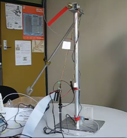
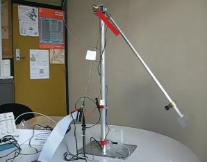

# DE2
Realtime system design with FPGA DE2

Abstract

The aim of this project is to develop a real time system to sense the motion of a pendulum and reproduce
the same motion with a DC motor driving a pointer (control a DC motor to mimick the motion of a pendulum). 

Setup:

  

Methods

A beam sensor was used to generate the motion of the disk 
